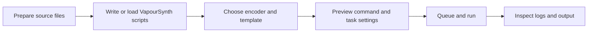

<div align="center">
  

  <h1>FlowEncode</h1>

  <p><strong>A Windows x64 frontend for video encoding, transcoding and VapourSynth workflows</strong></p>

  <p>
    <a href="./README.md">中文</a> ·
    <a href="https://frankie1024.github.io/FlowEncode/">Website</a> ·
    <a href="https://github.com/frankie1024/FlowEncode/releases">Download</a> ·
    <a href="https://github.com/frankie1024/FlowEncode/issues">Issues</a>
  </p>

  <p>
    
    
    
    
    
  </p>
</div>

---

FlowEncode is a Windows x64 desktop frontend for video encoding workflows. It coordinates `x264`, `x265`, `SVT-AV1`, `Av1an`, `FFmpeg`, `VapourSynth`, `VSPipe` and related public toolchains through one interface for task configuration, script editing, queue execution, log inspection and template reuse.

It is designed for users who want a graphical Windows video encoding GUI while keeping the flexibility of command-line encoders, VapourSynth scripts and Av1an automation.

> [!IMPORTANT]
> FlowEncode currently supports Windows x64 only. New installations should complete the in-app first-run environment guide before production use.

> [!NOTE]
> Transparency note: this project is heavily assisted by AI-generated code. The actual behavior, dependency boundaries and limitations are defined by the source code, release artifacts and this documentation.


## Table of Contents

- [Project Scope](#project-scope)
- [Feature Overview](#feature-overview)
- [Workflow](#workflow)
- [Supported Toolchain](#supported-toolchain)
- [Installation and Runtime Requirements](#installation-and-runtime-requirements)
- [Local Data and Privacy](#local-data-and-privacy)
- [Development and Build](#development-and-build)
- [Feedback and License](#feedback-and-license)

## Project Scope

FlowEncode is not a standalone encoder and does not bundle every dependency into a single distribution. It is closer to a workflow console for video encoding:

| Goal | Description |
| --- | --- |
| Unified configuration | Keep input/output paths, encoder parameters, script state, job queues and logs in one desktop interface. |
| Toolchain flexibility | Coordinate `x264`, `x265`, `SVT-AV1`, `Av1an`, `FFmpeg` and `VapourSynth` instead of replacing them. |
| Less repeated setup | Reduce daily encoding setup through templates, command previews, queue execution and environment guidance. |
| Local-first operation | Work with local files, local dependencies and a local workspace by default. |

## Feature Overview

| Module | Capabilities |
| --- | --- |
| Dashboard | Entry point for demux, VapourSynth, video encode, audio transcode, auto encode, templates and settings. |
| VapourSynth | Edit `.vpy` / `.py` scripts, open recent files, inspect diagnostics, preview frames, use crop helpers and read preview logs. |
| Video Encode | Configure regular encoding tasks with input/output paths, encoder arguments, command previews, job queues and real-time logs. |
| Auto Encode | Run Av1an-based target-quality workflows with `VMAF`, probe count, parallelism and extra encoder arguments. |
| Template Library | Save, load, import, export, pin and overwrite `.profile` templates for reusable encoding presets. |
| Environment Guide | Check, install, update or remove supported runtimes, plugins, encoders and command-line tools. |
| Settings and Updates | Manage workspace path, theme, language, dependency status, application updates and first-run guide access. |

## Workflow



Common usage patterns:

- Maintain `.vpy` scripts in the VapourSynth editor and inspect output frames in the preview window.
- Configure regular encoding tasks with `x264`, `x265` or `SVT-AV1`.
- Run VMAF-based target-quality automation through `Av1an`.
- Save stable settings as `.profile` templates and reuse them in future jobs.

## Supported Toolchain

| Type | Components |
| --- | --- |
| Video encoders | `x264`, `x265`, `SVT-AV1` |
| Auto encoding | `Av1an`, `VMAF` |
| Media probing and pipelines | `FFmpeg`, `FFprobe` |
| Script runtime | `Python 3.12`, `VapourSynth`, `vsrepo`, public VapourSynth plugins |
| Input bridge | `VSPipe`, `Avs2PipeMod` |
| Application framework | `.NET 8`, `WinUI 3`, `Windows App SDK` |

Support depth depends on upstream versions, local runtime state, plugin availability and user environment configuration. FlowEncode provides detection and guidance where possible, but it does not replace upstream installation instructions or licenses.

## Installation and Runtime Requirements

### Download

Download the latest Windows x64 installer from [GitHub Releases](https://github.com/frankie1024/FlowEncode/releases).

Current release assets are installer-based:

```text
FlowEncode_Setup_v<version>.exe
```

### Runtime prerequisites

The installer checks for the following components:

| Dependency | Purpose |
| --- | --- |
| Microsoft Visual C++ Redistributable x64 | Required by the WinUI desktop runtime. |
| Windows App Runtime x64 | Required by the unpackaged Windows App SDK host. |
| Microsoft Edge WebView2 Runtime | Required by the embedded VapourSynth editor surface. |

If a prerequisite is missing, the installer prompts the user to install it. Users may skip those steps and continue installing the main application, but the app may fail to start or related features may not work.

### Workspace

FlowEncode supports a separate workspace directory for:

- `downloads`
- `tools`
- `encoders`
- `Templates`

The installation directory is intended for application binaries and static resources. Runtime state, large toolchain files and user templates live under local application data or the configured workspace.

## Local Data and Privacy

FlowEncode is local-first by default:

- It does not actively upload source files, output files, templates or local paths.
- Lightweight runtime state is stored under `%LocalAppData%\FlowEncode\data`.
- User templates are stored in the workspace `Templates` folder and `.profile` files are loaded automatically.
- Large runtime directories such as `downloads`, `tools` and `encoders` are kept under the configured workspace.
- Review and redact logs, screenshots or cache files before sharing them publicly.

## Development and Build

The main application is a WinUI 3 desktop app:

| Project | Description |
| --- | --- |
| `FlowEncode` | WinUI 3 desktop entry point and UI layer. |
| `FlowEncode.Application` | Application service abstractions. |
| `FlowEncode.Domain` | Encoding configuration, job models and domain rules. |
| `FlowEncode.Infrastructure` | Local tool discovery, runners, cache and external integrations. |
| `FlowEncode.Domain.Tests` | Domain-layer tests. |

Build notes:

- Target framework: `net8.0-windows10.0.26100.0`
- Minimum target platform: `Windows 10.0.17763.0`
- Platform: `x64`
- UI: `WinUI 3` / `Windows App SDK`
- Release scripts: `scripts/`
- Installer script: `installer/`

This project has WinUI XAML compiler requirements. If plain `dotnet build` triggers Windows App SDK XAML compiler failures on your machine, build from the matching Visual Studio MSBuild environment.

## Feedback and License

- Issues: [GitHub Issues](https://github.com/frankie1024/FlowEncode/issues)
- Downloads: [GitHub Releases](https://github.com/frankie1024/FlowEncode/releases)
- Website: [GitHub Pages](https://frankie1024.github.io/FlowEncode/)

This repository is licensed under `GNU General Public License v3.0` and is treated as `GPL-3.0-only`. See [LICENSE](./LICENSE) for the full license text.

Third-party tools, runtimes, plugins and packages keep their own licenses. See [THIRD_PARTY_LICENSES.md](./docs/THIRD_PARTY_LICENSES.md) for the public support scope and license notes.
