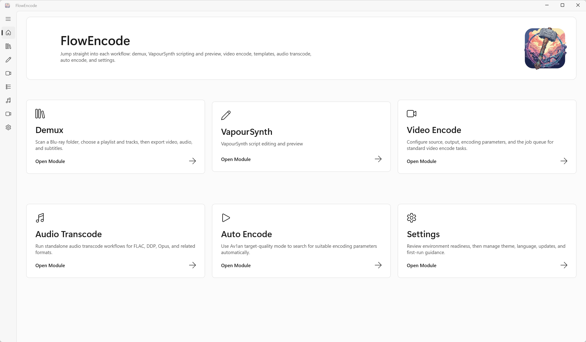

<div align="center">
  

  <h1>FlowEncode</h1>

  <p><strong>面向 Windows x64 的视频压制、转码与 VapourSynth 工作流前端</strong></p>

  <p>
    <a href="./README.en.md">English</a> ·
    <a href="https://frankie1024.github.io/FlowEncode/">官网</a> ·
    <a href="https://github.com/frankie1024/FlowEncode/releases">下载</a> ·
    <a href="https://github.com/frankie1024/FlowEncode/issues">问题反馈</a>
  </p>

  <p>
    
    
    
    
    
  </p>
</div>

---

FlowEncode 是一个面向 Windows x64 的桌面端编码工作流前端，围绕 `x264`、`x265`、`SVT-AV1`、`Av1an`、`FFmpeg`、`VapourSynth`、`VSPipe` 与相关公开工具链，提供统一的任务配置、脚本编辑、队列执行、日志查看和模板复用能力。

它适合需要图形化管理日常压制流程，同时仍希望保留命令行编码器、VapourSynth 脚本和 Av1an 自动压制灵活性的用户。

> [!IMPORTANT]
> FlowEncode 当前仅支持 Windows x64。首次使用前建议先完成应用内的首启环境引导。

> [!NOTE]
> 透明说明：本项目大量使用 AI 辅助开发。实际功能、依赖边界与已知限制以源码、发布包和本文档描述为准。



## 目录

- [核心定位](#核心定位)
- [功能概览](#功能概览)
- [工作流](#工作流)
- [支持的工具链](#支持的工具链)
- [安装与运行要求](#安装与运行要求)
- [本地数据与隐私](#本地数据与隐私)
- [开发与构建](#开发与构建)
- [反馈与许可](#反馈与许可)

## 核心定位

FlowEncode 不是单一编码器，也不是封装所有依赖的全家桶发行版。它更接近一个面向视频压制场景的工作流控制台：

| 目标 | 说明 |
| --- | --- |
| 统一配置 | 将输入输出、编码器参数、脚本环境、任务队列与日志集中到一个桌面界面。 |
| 保留灵活性 | 不替代 `x264`、`x265`、`SVT-AV1`、`Av1an`、`FFmpeg` 或 `VapourSynth`，而是协调它们参与工作流。 |
| 降低重复劳动 | 通过模板库、命令预览、队列执行和环境引导减少日常压制中的重复配置。 |
| 面向本地使用 | 默认围绕本机文件、本机依赖和本机工作目录运行，不主动上传源文件或模板。 |

## 功能概览

| 模块 | 能力 |
| --- | --- |
| 工作台 | 按流程进入解复用、VapourSynth、视频压制、音频转码、自动压制、模板库和设置等模块。 |
| VapourSynth | 提供 `.vpy` / `.py` 脚本编辑、最近文件、基础诊断、预览、帧查看、裁剪辅助和预览日志。 |
| 视频压制 | 配置常规编码任务，统一管理输入输出、编码参数、命令预览、任务队列和实时日志。 |
| 自动压制 | 基于 `Av1an` 组织目标质量流程，支持 `VMAF`、探测次数、并行度和编码器附加参数。 |
| 模板库 | 保存、载入、导入、导出、置顶和覆盖 `.profile` 模板，沉淀常用参数集。 |
| 环境引导 | 检测、安装、更新和移除公开支持的运行时、插件、编码器和命令行工具。 |
| 设置与更新 | 管理工作目录、主题、语言、依赖状态、应用更新和首启引导入口。 |

## 工作流


常见使用方式：

- 使用 VapourSynth 编辑器维护 `.vpy` 脚本，并通过预览窗口检查输出帧。
- 使用 `x264`、`x265` 或 `SVT-AV1` 配置常规编码任务。
- 使用 `Av1an` 进行基于 VMAF 的目标质量自动压制。
- 将稳定参数保存为 `.profile` 模板，在后续任务中快速复用。

## 支持的工具链

| 类型 | 组件 |
| --- | --- |
| 视频编码器 | `x264`、`x265`、`SVT-AV1` |
| 自动压制 | `Av1an`、`VMAF` |
| 媒体探测与管线 | `FFmpeg`、`FFprobe` |
| 脚本环境 | `Python 3.12`、`VapourSynth`、`vsrepo`、公开可用的 VapourSynth 插件 |
| 输入桥接 | `VSPipe`、`Avs2PipeMod` |
| 应用框架 | `.NET 8`、`WinUI 3`、`Windows App SDK` |

对具体工具的支持深度取决于上游版本、本机运行时状态、插件完整性和用户环境配置。FlowEncode 会尽量提供检测和引导，但不替代上游项目自身的安装说明和许可证。

## 安装与运行要求

### 获取安装包

前往 [GitHub Releases](https://github.com/frankie1024/FlowEncode/releases) 下载最新的 Windows x64 安装包。

当前发布资产以安装版为主：

```text
FlowEncode_Setup_v<version>.exe
```

### 运行前置依赖

安装器会检测以下组件：

| 依赖 | 作用 |
| --- | --- |
| Microsoft Visual C++ Redistributable x64 | WinUI 桌面应用运行依赖。 |
| Windows App Runtime x64 | 未打包 Windows App SDK 应用运行依赖。 |
| Microsoft Edge WebView2 Runtime | 内置 VapourSynth 编辑器界面依赖。 |

如果缺失，安装器会提示安装。用户可以跳过并继续安装主程序，但这可能导致应用无法启动或部分功能不可用。

### 工作目录

FlowEncode 支持单独配置工作目录，用于承载：

- `downloads`
- `tools`
- `encoders`
- `Templates`

程序安装目录默认只放程序本体和静态资源。运行期可写数据、大体积工具链和用户模板会放在应用数据目录或用户指定的工作目录中。

## 本地数据与隐私

FlowEncode 默认面向本地工作流：

- 不主动上传源文件、输出文件、模板内容或本地路径。
- 运行期轻量状态保存在 `%LocalAppData%\FlowEncode\data`。
- 用户模板保存在工作目录的 `Templates` 文件夹，并自动加载其中的 `.profile` 文件。
- `downloads`、`tools`、`encoders` 等目录位于独立工作目录，可在设置中调整。
- 对外分享日志、截图或缓存文件前，建议先人工检查并脱敏。

## 开发与构建

项目主体是 WinUI 3 桌面应用：

| 项目 | 说明 |
| --- | --- |
| `FlowEncode` | WinUI 3 桌面入口与界面层。 |
| `FlowEncode.Application` | 应用服务抽象。 |
| `FlowEncode.Domain` | 编码配置、任务模型和领域规则。 |
| `FlowEncode.Infrastructure` | 本地工具探测、运行器、缓存和外部集成。 |
| `FlowEncode.Domain.Tests` | 领域层测试。 |

构建注意事项：

- 目标框架：`net8.0-windows10.0.26100.0`
- 最低目标平台：`Windows 10.0.17763.0`
- 平台：`x64`
- UI：`WinUI 3` / `Windows App SDK`
- 发布脚本位于 `scripts/`
- 安装器脚本位于 `installer/`

官方构建入口：

```powershell
./scripts/build.ps1
./scripts/test.ps1
```

常用命令：

```powershell
./scripts/build.ps1 -Configuration Release
./scripts/build.ps1 -Configuration Release -RunTests
./scripts/build-release-assets.ps1
```

说明：

- `scripts/build.ps1` 会自动定位 Visual Studio `MSBuild.exe`，并在构建前校验仓库版本元数据是否同步。
- `scripts/test.ps1` 统一执行 `FlowEncode.Domain.Tests`。
- 当前 WinUI XAML 编译链路仍以 Visual Studio `MSBuild.exe` 为官方入口；`dotnet build` 继续保留保护性失败，避免在不稳定环境下产出误导性的构建结果。

发布流程：

1. 更新 `build/Version.props` 中的版本号。
2. 运行 `./scripts/sync-version-metadata.ps1`，确认 `README`、`Package.appxmanifest` 与 `app.manifest` 已同步。
3. 编写 `.github/release-notes/v<version>.md`，按双语用户向格式明确列出本次更新内容。
4. 提交版本变更后，在目标提交上创建并推送 `v<version>` tag。
5. GitHub Actions `Release` 工作流会校验 tag、版本元数据和 release note 文件，然后自动构建安装包并发布 GitHub release。

## 反馈与许可

- 问题反馈：[GitHub Issues](https://github.com/frankie1024/FlowEncode/issues)
- 版本下载：[GitHub Releases](https://github.com/frankie1024/FlowEncode/releases)
- 项目官网：[GitHub Pages](https://frankie1024.github.io/FlowEncode/)

本仓库源码采用 `GNU General Public License v3.0`，按 `GPL-3.0-only` 处理。完整许可证文本见 [LICENSE](./LICENSE)。

程序调用或协作的第三方工具、运行时、插件与包分别遵循其各自许可证条款。公开支持范围与许可证说明见 [THIRD_PARTY_LICENSES.md](./docs/THIRD_PARTY_LICENSES.md)。
